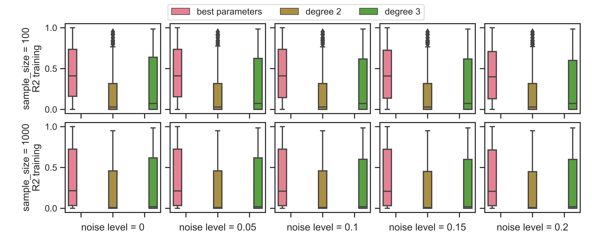
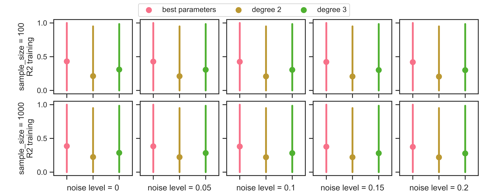
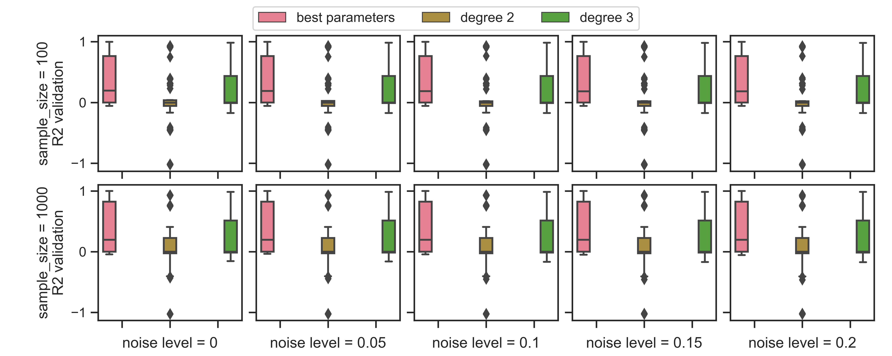
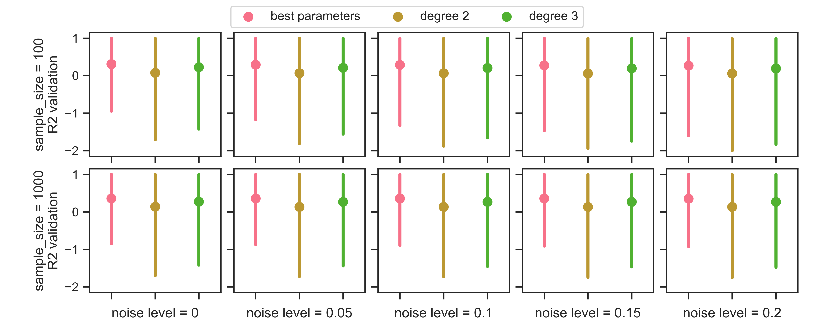

# SCR-Benchmark-SCPR
This repository contains the results of **shape-constrained polynomial regression (SCPR)** on datasets of our shape-constrained regression benchmark [SCR-Benchmark](https://github.com/florianBachinger/SCR-Benchmarks-NIPS).


## Shape-constrained polynomial regression (SCPR)
The hyperparameters of SCPR are the total degree- $d$
of the polynomial, $\lambda$, to determine the strength of regularization, and $\alpha$ to
balance the 1-norm and the 2-norm penalties. We solve the semidefinite programming problem using the commercial solver [Mosek](https://www.mosek.com). Cf. [Hall](http://arks.princeton.edu/ark:/88435/dsp014m90dz20p) for a detailed
mathematical description of SCPR.

### Hyper-Parameters
We investigated the following hyper parameter space in a gridsearch for the best SCPR parameters per equation. `./experiments/1-benchmark_data_generation_SCPR.py` lists the full implementation where we also append the parameters of SCPR to our `<equation_name>.json` info files.

```python
from SCRBenchmark import FEYNMAN_SRSD_HARD,HARD_NOISE_LEVELS,HARD_SAMPLE_SIZES
from SCRBenchmark import BenchmarkSuite

Degrees = [1,2,3,4,5,6,7]
Lambdas = [10**-7,10**-6,10**-5,10**-4,10**-3,10**-2,10**-1,1,10]
Alphas = [0,0.5,1]
MaxInteractions = [2,3,4]

BenchmarkSuite.create_hard_instances(target_folder = target_folder,
                                        Equations= FEYNMAN_SRSD_HARD,
                                        sample_sizes=HARD_SAMPLE_SIZES,
                                        noise_levels=HARD_NOISE_LEVELS)
```

### Results
For the sake of comparsion, in our initial publication, we compare the respective best configuration for each equation (degree- $d$ , $\alpha$ , $\lambda$ , max interactions) to the respective best configurations for lower degree polynomial (so: degree- $d \in {2,3}$ but respective best, $\alpha$, $\lambda$, max interactions).

These **preliminary** results contain only the 18 bonus Feynman equations.

Experiments are repeated 10 times and we report the median of these repetitions over all equations.
Results on the training data:

**IMPORTANT:** notice that these results no longer match those reported in our paper submission from 7th of June with the [commit 501c4fb](https://github.com/florianBachinger/SCR-Benchmark-SCPR/commit/501c4fbf59d37b31e4d3c4eef7d328391f0da2a3). 
We since identified a bug in our SCPR setup and updated the preliminary results. 
The bug was caused by some equation instances being unsolvable for our SCPR solver, especially for polynomials of lower degree.
The supplementary material addresses this issue by reporting how many of the 10 repetitions ran successfully and excluding unsuccessful runs and their assigned default $R^2$ from the results plotted in the figure. 

This issue significantly affects one equation instance for runs of degree 2 and degree 3. Whereas the best SCPR configuration is only affected in 1/10 repetitions. Cf. the `./result/` folder or our evaluation script `./experiments/10-report_table.py` for more details.






Results on the validation data (no noise, more data points in the extrapolation range. See our [benchmark repository](https://github.com/florianBachinger/SCR-Benchmarks-NIPS) for more details):



